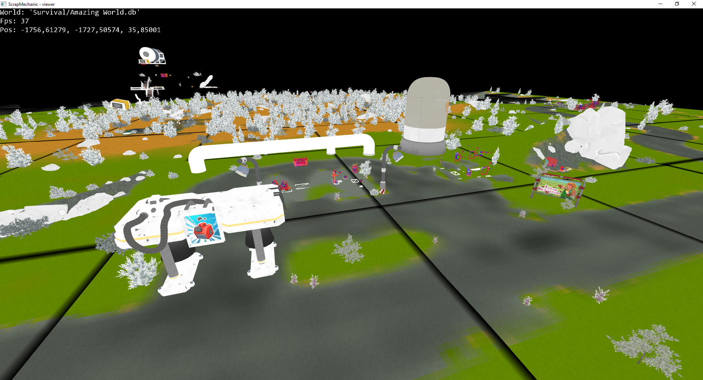

# ScrapMechanicWorldViwer
This tool was made to view ScrapMechanic world files.

This tool uses LWJGL 3.

<b>NOTE: Because this tool is still under construction trying it out might be hard to run this and will probably result in errors.</b>

This is a try to create a independant sqlite library for scrap mechanic with a render implemented.

## Features
* The viewer can display survival worlds and knows how to load tile files

## Progression
The next step with the viewer is to fix the asset shader and allow for colors instead of white textures.
And loading BlueprintList and Prefabs from the `.TILE` files.

## Screenshot
